A decade of infosec tools
=========================

## Tutorial
The whole study has been achieved with the Dataiku Data Science Studio (DSS) Free edition.  
As a consequence, the study code and datasets are provided under a [Dataiku DSS project](../Dataiku%20DSS%20project).  
The following tutorial should help you setup the environment to be able to reproduce the study.  
  
  
## 1. Install Dataiku DSS
The first step is to install, if you don't already have it, Dataiku DSS.  
It comes in [several forms](https://www.dataiku.com/dss/trynow/free-edition/) but this tutorial will be based on the `VirtualBox / VMWare` version.  
So first, follow [these steps](https://www.dataiku.com/dss/trynow/virtualbox/).  
The system credentials are `dataiku` for login and password  


## 2. Install Python 3.6 in the Dataiku DSS VM
By default, only Python 2.7 is installed in the VM provided by Dataiku.  
This study has been achieved with Python 3 code so for this step, in your VM, install Python 3.6:
```
$ sudo yum install python36
```
  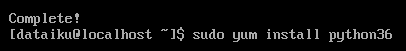


## 3. Import the custom code-environment
This study has been achieved with Python 3 and some external dependencies (`pygithub`, `lxml`, `markdownify`, `beautifulsoup4`, `safety`) so a custom Dataiku `code-environment`, which is a regular Python `virtualenv`, has been created to package everything.  
  1. `Administration` > `Code envs` > `Import env`  
    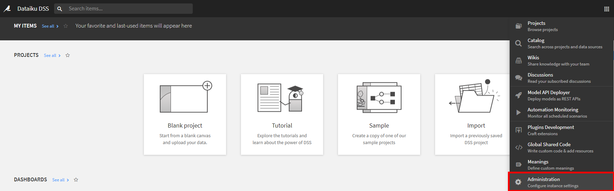
    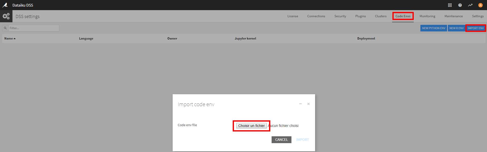
  
  2. Click on `Select a file` and choose the [code-environment zip file provided here](../Dataiku%20DSS%20project/adecadeofinfosectools.zip)
  
  3. Click on `Import`
  
  4. Click on the imported code environment named `adecadeofinfosectools` > `Packages to install` > `Update`. It will download and install these dependencies.  
    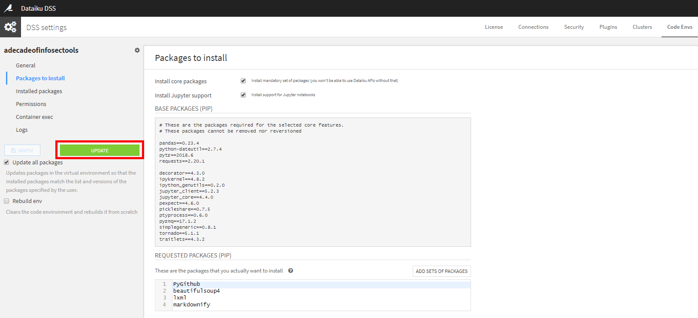


## 4. (optional) Set Github credentials as environment variables
At one stage of the study, 2300+ github repositories have been analyzed, by collecting for each, a lot of metadata (stars, forks, watchers, commit dates, etc.).  
This has been achieved with the [`PyGithub`](https://pygithub.readthedocs.io/en/latest/introduction.html) external module, calling [Github API](https://developer.github.com/v3/).  
Facing Github [rate limit](https://developer.github.com/v3/rate_limit/) for API calls, I created 12 different accounts (with the same password :-)) to be able to process the 2300+ repositories asynchronously in (less than) 1 hour.  
If you want to reproduce this study step, you will need to also provide account credentials, as system environment variables.  
  * `Administration` > `Settings` > `Variables`
    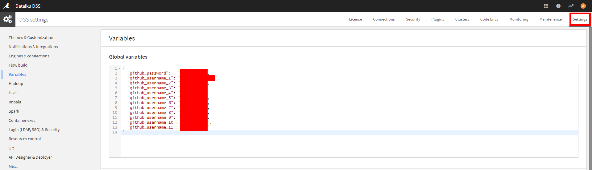
    ```
    {
      "github_password": "<password>",
      "github_username_1": "<username>",
      "github_username_2": "<username>",
      "github_username_3": "<username>",
      "github_username_4": "<username>",
      "github_username_5": "<username>",
      "github_username_6": "<username>",
      "github_username_7": "<username>",
      "github_username_8": "<username>",
      "github_username_9": "<username>",
      "github_username_10": "<username>",
      "github_username_11": "<username>",
      "github_username_12": "<username>"
    }
    ```

## 5. Import the project
  1. Go to the Dataiku homepage and select `Import project`
    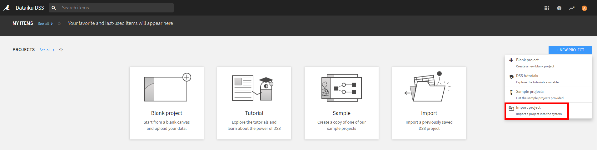
  
  2. Choose the [project zip file provided here](../Dataiku%20DSS%20project/ADECADEOFINFOSECTOOLS_20191020.zip)
    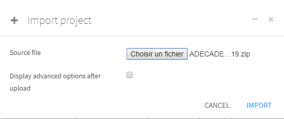
  
  3. Remap `Connection`, which is the root file path of the project on the VM ; and the `Code-environment`, as is and then click on `Import`:  
    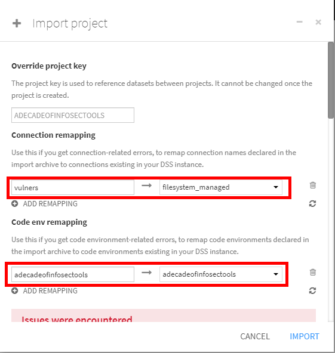

The `managed_datasets` folder is there on the Dataiku DSS VM, it contains all input, intermediate and output datasets:
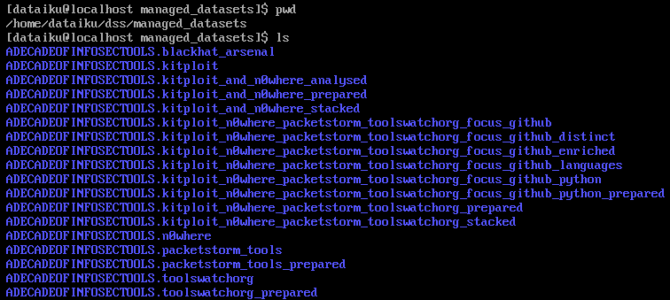


## 6. Explore the project
If you're reading this section, previous actions went well.  
You now have the full project environment, you can start exploring data and code:  
  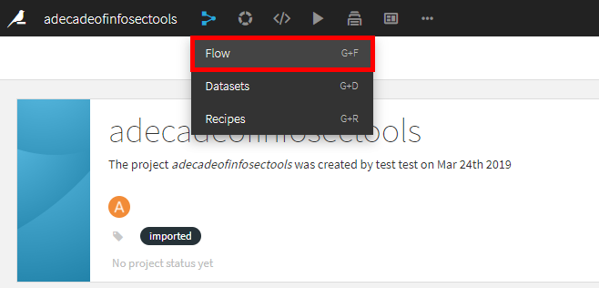
  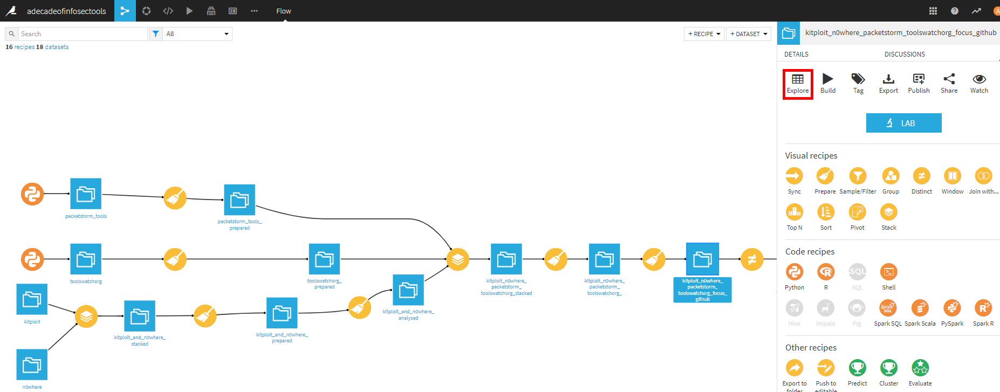
  
The datasets to specifically inspect are [those exported here](../Datasets%20exports).


## 7. Going further with Dataiku DSS
Take some time to read the [Dataiku DSS tutorials](https://academy.dataiku.com/latest/tutorial/basics/index.html) to handle that great tool.